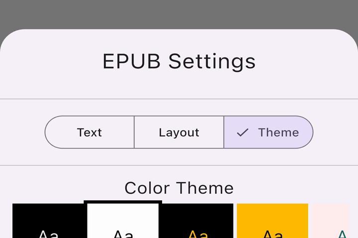
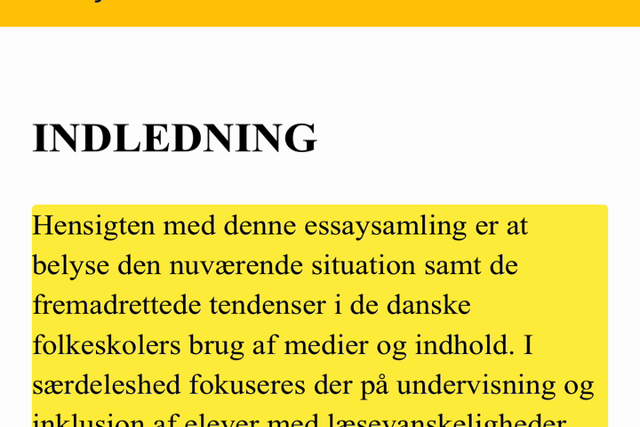

# flutter_readium

Build EPUB, PDF, audiobook, comic, and WebPub readers in Flutter with one unified Dart API—powered
by Readium toolkits on iOS, Android, and Web.

[](https://pub.dev/packages/flutter_readium)
[](https://github.com/notalib/flutter_readium/actions/workflows/quality.yml)
[](https://github.com/notalib/flutter_readium/actions/workflows/test.yml)
[](https://github.com/notalib/flutter_readium/actions/workflows/ci.yml)

<p align="center">
  
</p>

<p align="center"><em>Captured on iOS; synchronized narration uses the same Dart API on Android and Web.</em></p>

<p align="center">
  <a href="docs/getting-started/quick-start.md"><strong>Get started</strong></a> ·
  <a href="flutter_readium/example/"><strong>Example app</strong></a> ·
  <a href="https://pub.dev/documentation/flutter_readium/latest/"><strong>API docs</strong></a>
</p>

| Reading | Listening | Rich formats |
| :---: | :---: | :---: |
|  |  |  |
| EPUB themes, layout, and highlights | Synchronized narration on iOS, Android, and Web | PDF and comic/DiViNa navigation |

## Quick start

Add the package:

```bash
flutter pub add flutter_readium
```

See the [complete reader screen](flutter_readium/README.md#quick-start) for opening a local file or URL,
mounting the reader, and closing the publication. The [five-minute walkthrough](docs/getting-started/quick-start.md)
continues with navigation, preferences, and position restoration.

## Features

- EPUB 2 / EPUB 3 reading, with dynamic horizontal pagination and vertical scrolling modes
- PDF reading on iOS (PDFKit) and Android (PDFium), with layout, reading-progression, page-spacing, and fit preferences
- WebPub reading (including audiobook WebPub)
- Pre-recorded audio playback with track navigation and variable speed
- Synchronized Media Overlays in WebPubs (text-and-audio read-along)
- Platform-native text-to-speech with voice selection, speed, and pitch
- Reader preferences (typography, theme, scroll, columns, ...) via the Readium Preferences API
- App-supplied static reader fonts on iOS, Android, and Web
- Highlights and annotations via the Decorator API
- Position persistence and restoration via Locators
- Content search within open publications
- Real-time event streams for position, playback state, reader status, and errors
- Custom HTTP headers for publication and resource fetching

## How it works

flutter_readium is a federated plugin that delegates to the upstream Readium toolkit on each
platform:

- **swift-toolkit 3.11.0** on iOS
- **kotlin-toolkit 3.3.0** on Android
- **ts-toolkit** (`@readium/shared`, `@readium/navigator`) on Web

The canonical version pins live in `flutter_readium/ios/flutter_readium.podspec`, `flutter_readium/android/build.gradle` (`ext.readium_version`), and `flutter_readium/package.json`. Run `bin/readium_versions` to print them at any time.

## Supported formats

| Format    | Visual       | TTS | Audio | Media Overlays         |
| --------- | :----------: | :-: | :---: | :--------------------: |
| EPUB 2    |      ✓       |  ✓  |   —   |           -            |
| EPUB 3    |      ✓       |  ✓  |   ✓   |           -            |
| WebPub    |      ✓       |  ✓  |   ✓   | ✓ (EPUB profile)       |
| Audiobook |      —       |  —  |   ✓   |           -            |
| PDF       |      ✓       |  —  |   —   |           -            |
| CBZ       |      ✓       |  —  |   —   |           -            |
| DiViNa    |      ✓       |  —  |  ✓¹   | ✓¹ (Guided Navigation) |

¹ DiViNa audio narration is driven by a Guided Navigation document and synchronizes at the page
level on all platforms (on Web, ts-toolkit has no DiViNa navigator, so images are rendered by a
plugin-side navigator). Panel-level zoom (the segments' `xywh` regions) is not yet implemented on
any platform.

LCP-protected publications are not currently supported. The underlying toolkits include an LCP adapter; it may be enabled in a future release.

## Platform support

| Feature                  | Android | iOS | Web        |
| ------------------------ | :-----: | :-: | :--------: |
| EPUB visual reading      |    ✓    |  ✓  |     ✓      |
| Comics (CBZ / DiViNa)    |    ✓    |  ✓  |     ✓      |
| PDF reading              |    ✓    |  ✓  |     —      |
| Audiobook playback       |    ✓    |  ✓  |     ✓      |
| Media Overlays           |    ✓    |  ✓  |     ✓      |
| Text-to-Speech           |    ✓    |  ✓  |  Limited¹  |
| Highlights / decorations |    ✓    |  ✓  |     ✓      |
| Reader preferences       |    ✓    |  ✓  |     ✓      |
| PDF preferences          |    ✓    |  ✓  |     —      |
| Progress saving          |    ✓    |  ✓  |     ✓      |
| Content search           |    ✓    |  ✓  |     —      |
| Background audio         |    ✓    |  ✓  |     —      |

¹ Web TTS uses the browser's Web Speech API — voice availability and quality vary by browser.

> **macOS note:** Native macOS desktop (`flutter run -d macos`) is not supported — a no-op stub is registered so the Flutter macOS target still compiles, but every reader call returns `MethodNotImplemented`. The upstream `swift-toolkit` is iOS-only and has marked native macOS [`not_planned`](https://github.com/readium/swift-toolkit/issues/783). The iOS build runs fine on Apple Silicon Macs via "Designed for iPad".

## Minimum requirements

| Requirement | Version                |
| ----------- | ---------------------- |
| Flutter     | 3.44.8+                |
| Dart SDK    | 3.8.0+                 |
| Android     | `minSdkVersion` 24     |
| iOS         | 15.0+                  |

The development SDK is pinned separately in `.flutter-version`; contributors should use
`bin/update_flutter_version` to change that pin.

## Platform setup

Complete the per-platform setup below before running the reader. See the full
[installation guide](docs/getting-started/installation.md) for details.

### Android

- Set `minSdkVersion` to 24 or higher in `android/app/build.gradle`.
- Enable [core library desugaring](https://developer.android.com/studio/write/java8-support) — the
  readium-kotlin-toolkit artifacts require it, and the build fails at `checkDebugAarMetadata`
  without it:

  ```kotlin
  android {
      compileOptions {
          isCoreLibraryDesugaringEnabled = true
      }
  }

  dependencies {
      coreLibraryDesugaring("com.android.tools:desugar_jdk_libs:2.1.5")
  }
  ```
- Change your `MainActivity` to extend `FlutterFragmentActivity` (not `FlutterActivity`) — otherwise the reader view will crash at runtime.
- If using TTS or background audio, add to `android/app/src/main/AndroidManifest.xml`:

  ```xml
  <uses-permission android:name="android.permission.WAKE_LOCK" />
  <uses-permission android:name="android.permission.FOREGROUND_SERVICE" />
  <uses-permission android:name="android.permission.FOREGROUND_SERVICE_MEDIA_PLAYBACK" />
  ```

#### Build-time configuration

The Android plugin exposes the following Gradle properties. Set them in your
app's `android/gradle.properties` to override the defaults at build time:

| Property | Default | Description |
| -------- | ------- | ----------- |
| `flutterReadium.mediaOverlayFetchConcurrency` | `8`     | Max number of media-overlay JSON files the Sync Audiobook navigator fetches in parallel. Higher values speed up opening publications with many overlays at the cost of more concurrent HTTP requests. |

Example `android/gradle.properties`:

```properties
flutterReadium.mediaOverlayFetchConcurrency=16
```

### iOS

Add the Readium pods to your `ios/Podfile`.

To avoid documentation drift, copy the exact Readium pod lines from:

- `flutter_readium/example/ios/Podfile` (source-of-truth for app integration)
- and keep them aligned with `flutter_readium/ios/flutter_readium.podspec` (plugin-side pin)

Example shape:

```ruby
target 'Runner' do
  use_frameworks!
  use_modular_headers!
  # Readium pod lines: copy from flutter_readium/example/ios/Podfile
  # ...
end
```

### Web

1. Copy the plugin's JavaScript bundle into your web app:

   ```bash
   dart run flutter_readium:copy_js_file <destination_directory>
   ```

   The destination should live inside your `web/` directory.

2. Reference the script from `web/index.html`:

   ```html
   <script src="flutter.js" defer></script>
   <script src="readiumReader.js" defer></script>
   ```

## Documentation

Full documentation is in [docs/](docs/):

- **Getting Started**
  - [Installation](docs/getting-started/installation.md)
  - [Quick Start](docs/getting-started/quick-start.md)
  - [Core Concepts](docs/getting-started/concepts.md)
- **Guides**
  - [EPUB Reading](docs/guides/epub-reading.md)
  - [Audiobook Playback](docs/guides/audiobook-playback.md)
  - [Text-to-Speech](docs/guides/text-to-speech.md)
  - [Preferences](docs/guides/preferences.md)
  - [Highlights & Annotations](docs/guides/highlights-annotations.md)
  - [Search](docs/guides/search.md)
  - [Custom HTTP Headers](docs/guides/http-headers.md)
  - [Saving Progress](docs/guides/saving-progress.md)
  - [Error Handling](docs/guides/error-handling.md)
- **API Reference**
  - [FlutterReadium class](docs/api-reference/flutter-readium.md)
  - [ReaderWidget](docs/api-reference/reader-widget.md)
  - [Locator](docs/api-reference/locator.md)
  - [Preferences](docs/api-reference/preferences.md)
  - [Decorations](docs/api-reference/decorations.md)
  - [Streams & Events](docs/api-reference/streams-events.md)
  - [Error Codes](docs/api-reference/error-codes.md)
  - [Publication](docs/api-reference/publication.md)
- **Architecture** — [Overview](docs/architecture.md)
- **Troubleshooting** — [Troubleshooting](docs/troubleshooting.md)

## Example app

A complete example app is available in [flutter_readium/example/](flutter_readium/example/), demonstrating EPUB and audiobook reading, TTS, preferences, and highlighting:

```bash
cd flutter_readium/example && flutter run
```

The README animation is driven by a small integration-test-style showcase and recorded from a
booted iOS Simulator. Once the generated test fixtures are installed, regenerate it with:

```bash
bin/generate_readme_demo [--no-bezel] [--device-id <simulator-udid>]
```

The physical device bezel is included by default. The script keeps the H.264 master under
`build/readme-demo/` and replaces the checked-in GIF only after the capture and size checks pass.

### Dependency size analysis

- helper scripts: `cd flutter_readium/assets/_helper_scripts && npm run build:stats` (outputs `flutter_readium/assets/helpers/stats.html` and `flutter_readium/assets/helpers/stats.json`)
- web bundle: `cd flutter_readium && npm run build:stats` (outputs `flutter_readium/build/rollup-stats.html` and `flutter_readium/build/rollup-stats.json`)

## Contributing

See [CONTRIBUTING.md](CONTRIBUTING.md) for development setup, build scripts, and contribution guidelines.

## License

BSD 3-Clause — see [LICENSE](LICENSE).
