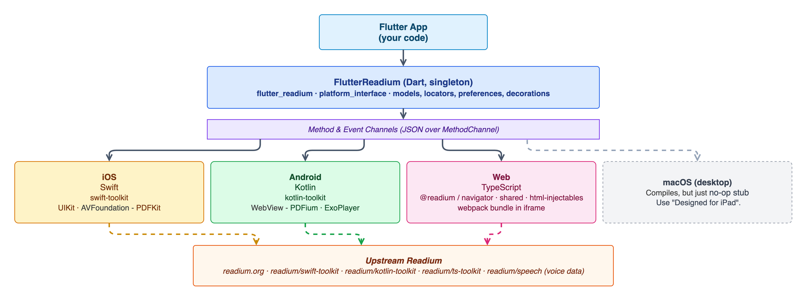

# Architecture Overview

## Package structure

This is a federated Flutter plugin split into two pub packages:

```
flutter_readium/                      : app-facing package
flutter_readium_platform_interface/   : shared models & platform contract
```



> Source: [diagrams/architecture.drawio](diagrams/architecture.drawio). Re-export with `draw.io -x -f png --scale 2 -b 20 -o docs/diagrams/architecture.png docs/diagrams/architecture.drawio`.

The plugin exposes `FlutterReadiumPlatform` as the abstract interface, with `MethodChannelFlutterReadium` as the default implementation routing calls to each native side. `ReadiumReaderWidget` is a platform view that renders the reader surface.

## Communication

All Dart↔native communication uses Flutter method channels and event channels defined in `MethodChannelFlutterReadium`:

- **Method channel** (`flutter_readium`) — request/response calls (open, navigate, preferences, …)
- **Event channels** — one-way streams from native to Dart:
  - `flutter_readium/reader_status`
  - `flutter_readium/text_locator`
  - `flutter_readium/timebased_state`
  - `flutter_readium/error_event`

Opening a publication: Dart sends the URL over the method channel → native parses via Readium → returns a JSON Publication manifest → Dart deserialises into a `Publication` object.

Position updates travel the reverse direction via the text locator event channel.

## Models

All models in `flutter_readium_platform_interface` define hand-written `toJson` / `fromJson` methods (via the `JSONable` mixin) for cross-platform serialisation, persistence, and debugging. The package does not use `json_serializable` or `freezed` code generation.

## Bridge serialization

Two encodings cross the method channel, chosen by who owns the schema:

- **Readium-owned objects** (`Locator`, `Decoration`, …) → **JSON strings** via `json.encode`. The upstream toolkits already own the schema and provide the deserializers, so encoding as a string avoids lossy `[String: Any]` / `Map<String, dynamic>` round-trips on the native sides.
- **Plugin-owned flat structures** (preferences, action configs) → **Maps / Dictionaries**, where the shape is simple and fully controlled by this plugin.

### Web TS: Locator → JSON always via `.serialize()`

`@readium/shared` Locators store extra location fields (e.g. `cssSelector`, `tocHref`) in `locations.otherLocations` as a `Map<string, any>`. `JSON.stringify(locator)` **silently drops all Map entries.** Rules:

- Emitting a Locator to Dart: `JSON.stringify(locator.serialize())`.
- Embedding a locator inside a larger object before stringifying: call `locator.serialize()` first.
- Deep-cloning: `JSON.parse(JSON.stringify(locator.serialize()))`, never `JSON.parse(JSON.stringify(locator))`.
- Reading `otherLocations` entries needs the Map API: `locator.locations?.otherLocations?.get('cssSelector')`, not `(locator.locations as any)?.cssSelector`.

## Singleton pattern

`FlutterReadium` is a singleton — there is one reader active at a time. The global publication lifecycle (open/close) is managed centrally. Do not introduce per-instance state without reviewing the existing lifecycle.

## Web implementation

The web plugin is a TypeScript/webpack bundle (`flutter_readium/web/src/`) compiled to `flutter_readium/lib/helpers/readiumReader.js`. It is loaded inside a webview and communicates with Dart via `postMessage` / JS interop.

After any TypeScript change run `bin/update_web_example` to rebuild and deploy to the example app.

## Native toolkits

| Platform | Toolkit | Version |
|----------|---------|---------|
| iOS | swift-toolkit | 3.11.0 |
| Android | kotlin-toolkit | 3.3.0 |
| Web | `@readium/*` npm packages | see `flutter_readium/package.json` |

Native macOS desktop is not supported — the plugin registers a no-op stub on the Flutter macOS target so apps still compile, but every reader call returns `MethodNotImplemented`. The upstream swift-toolkit declares `platforms: [.iOS("15.0")]`, links UIKit, and has marked native macOS [`not_planned`](https://github.com/readium/swift-toolkit/issues/783). The iOS build runs fine on Apple Silicon Macs via "Designed for iPad".

When upgrading any toolkit version, verify that all three platforms move together where API surface overlaps.
From repo root, run `bin/readium_versions` to print the current pinned values from the source-of-truth files.
